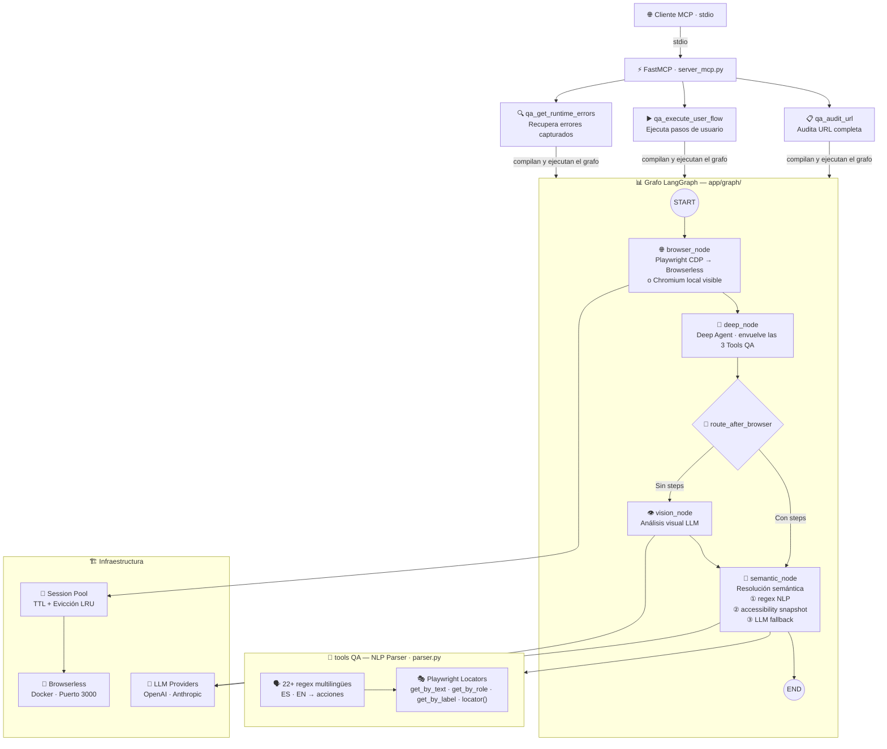

# AIDevTeam

# VFA — Visual & Functional Auditor

VFA (Visual & Functional Auditor) es un servidor MCP construido con FastMCP que audita aplicaciones web usando el navegador remoto Browserless (Docker) via CDP con Playwright y analisis LLM multimodal. Expone 3 tools QA: `qa_audit_url` (audita una URL y reporta errores de consola, excepciones JS y fallos HTTP), `qa_execute_user_flow` (ejecuta un flujo de usuario en lenguaje natural) y `qa_get_runtime_errors` (recupera los errores de ejecucion capturados).

## 1. Arquitectura general



- **Config:** `app/config.py` — variables de entorno vía `python-dotenv`.
- **Grafo LangGraph** (`app/graph/`): orquestador con nodos `browser`, `deep`, `vision`, `semantic` y router condicional. Flujo: START → browser → deep → (semantic|vision) → semantic → END.
- **Session Pool** (`app/session_pool.py`): pool de sesiones persistentes con TTL y evicción LRU. Conexión vía `app/browser.py` (Playwright + CDP Browserless).
- **Deep Agent** (`app/agents/deep_agent.py`): agente autónomo de `deepagents` que envuelve las 3 tools QA como nodo `deep`.
- **Reconexión** (`app/tools/qa.py`): reconexión automática (MAX_RECONNECTS=3) al perder la sesión remota.
- **Captura** ([`app/capture.py`](app/capture.py)): listeners de consola JS, excepciones JS (`pageerror`) y fallos HTTP (status >= 400) en [`app/capture.py`](app/capture.py).
- **NLP → Playwright** (`app/tools/parser.py`): 22+ regex multilingües → acciones Playwright. Fallback semántico en `app/semantic.py` (regex → accesibilidad → LLM).

## 2. Requisitos previos

- Docker Desktop (Windows/macOS) o Docker Engine (Linux) para Browserless.
- Python 3.10 o superior (agregado al PATH; en Linux/macOS el comando puede ser `python3`).
- Git.

## 3. Instalación

### Windows (PowerShell)

```powershell
# 1. Clonar el repositorio
git clone <URL-del-repositorio>
cd VFA

# 2. Crear y activar el entorno virtual
python -m venv .venv
.venv\Scripts\Activate.ps1

# 3. Instalar dependencias
pip install -r requirements.txt
```

> Si la activacion falla por la politica de ejecucion de PowerShell, consulta la seccion [Solución de problemas](#8-solución-de-problemas-comunes-en-windows).

### Linux / macOS (bash/zsh)

```bash
# 1. Clonar el repositorio
git clone <URL-del-repositorio>
cd VFA

# 2. Crear y activar el entorno virtual
python3 -m venv .venv
source .venv/bin/activate

# 3. Instalar dependencias
pip install -r requirements.txt
```

## 4. Levantar Browserless con Docker

```powershell
docker run -d -p 3000:3000 --name browserless -e "CONCURRENCY=10" ghcr.io/browserless/chromium
```

- `-p 3000:3000` — mapea el puerto 3000 usado por `BROWSERBASE_URL` (`ws://localhost:3000`).
- `-e "CONCURRENCY=10"` — limita a 10 las peticiones concurrentes.
- `--name browserless` — nombre fijo para gestionarlo (`docker start/stop/logs browserless`). Verificar con `docker ps`.

## 5. Configuración

Variables de entorno leidas en tiempo de ejecucion por `app/config.py`; un archivo `.env` en la raiz se carga automáticamente via `python-dotenv`.

### 5.1 Variables de entorno

| Variable | Default | Descripción |
| --- | --- | --- |
| `BROWSERBASE_URL` | `ws://localhost:3000` | URL del navegador remoto Browserless (endpoint CDP). |
| `STAGEHAND_BROWSER` | *(sin default)* | Selecciona el navegador remoto usado por Playwright (`browserless`). |
| `OPENAI_API_KEY` | *(sin default)* | API key de OpenAI. Usada como fallback para LLM y visión. |
| `ANTHROPIC_API_KEY` | *(sin default)* | API key de Anthropic. Usada como fallback de visión si el proveedor es `anthropic`. |
| `VISION_MODEL` | *(sin default)* | Modelo de visión configurado (si se omite, se usa el default del proveedor). |
| `VFA_LLM_PROVIDER` | `openai` | Proveedor LLM por defecto (`openai`, `anthropic`, `ollama`, etc.). |
| `VFA_LLM_MODEL` | `gpt-4o` | Modelo LLM por defecto. |
| `VFA_LLM_API_KEY` | *(sin default)* | API key LLM genérica. Si no se define, se usa `OPENAI_API_KEY`. |
| `VFA_VISION_PROVIDER` | `VFA_LLM_PROVIDER` o `openai` | Proveedor de visión. Si no se define, hereda de `VFA_LLM_PROVIDER` y, en su defecto, `openai`. |
| `VFA_VISION_MODEL` | `VFA_LLM_MODEL` o `gpt-4o` | Modelo de visión. Si no se define, hereda de `VFA_LLM_MODEL` y, en su defecto, `gpt-4o`. |
| `VFA_VISION_API_KEY` | *(sin default)* | API key de visión. Si no se usa, hereda de `VFA_LLM_API_KEY`/`OPENAI_API_KEY`; si el proveedor es `anthropic`, acepta `ANTHROPIC_API_KEY`. |
| `VFA_LLM_REQUESTS_PER_SECOND` | `0` | Peticiones por segundo del rate limiter. `0` desactiva el rate limiter. |
| `VFA_LLM_CHECKS_PER_SECOND` | `10.0` | Frecuencia (en segundos) con la que el rate limiter revisa el cupo. |
| `VFA_SESSION_POOL_ENABLED` | `true` | Activa el pool de sesiones persistentes entre llamadas a tools QA. |
| `VFA_SESSION_POOL_TTL` | `300` | Segundos de inactividad antes de cerrar una sesión. |
| `VFA_SESSION_POOL_MAX_SIZE` | `5` | Máximo de sesiones simultáneas (evicción LRU). |
| `NAVIGATION_WAIT_UNTIL` | `load` | Estrategia de espera de Playwright para navegación (`load`, `domcontentloaded`, `networkidle`, `commit`). Configurable vía variable de entorno. |
| `HEADLESS` | `true` | Indica si el navegador corre en modo headless (`true`) o con ventana visible (`false`). |
| `VFA_SESSION_STORAGE_STATE` | `session_storage_state.json` | Ruta del archivo storageState (cookies de Playwright) persistido entre flujos para reutilizar sesiones. |

### 5.2 Ejemplo de archivo `.env`

```dotenv
# Navegador remoto
BROWSERBASE_URL=ws://localhost:3000
STAGEHAND_BROWSER=browserless

# LLM
VFA_LLM_PROVIDER=openai
VFA_LLM_MODEL=gpt-4o
OPENAI_API_KEY=tu-api-key-de-openai

# Visión (opcional; hereda del LLM si se omite)
VFA_VISION_PROVIDER=openai
VFA_VISION_MODEL=gpt-4o

# Headless (opcional, default true)
# HEADLESS=false

# Storage State (opcional)
# VFA_SESSION_STORAGE_STATE=session_storage_state.json

# Rate limiter (opcional)
VFA_LLM_REQUESTS_PER_SECOND=0
VFA_LLM_CHECKS_PER_SECOND=10.0
```

### 5.3 Configuración de variables de entorno (Windows / Linux / macOS)

**Windows (PowerShell):**

```powershell
$env:STAGEHAND_BROWSER="browserless"
$env:BROWSERBASE_URL="ws://localhost:3000"
```

**Linux / macOS (bash/zsh):**

```bash
export STAGEHAND_BROWSER=browserless
export BROWSERBASE_URL=ws://localhost:3000
```

Persistencia: en Windows, `setx BROWSERBASE_URL "ws://localhost:3000"` y `setx STAGEHAND_BROWSER "browserless"` (permanente a nivel de usuario); en Linux/macOS, añade las líneas `export` a `~/.bashrc` o `~/.zshrc`. La opción recomendada y multiplataforma es el archivo `.env` en la raíz del proyecto.

## 6. Ejecución del servidor MCP

```powershell
python server_mcp.py
```

Servidor MCP con transporte `stdio`: configuralo como servidor MCP tipo stdio en tu cliente (apuntando al interprete del venv si es necesario). Una vez conectado, expone las 3 tools QA descritas al inicio.

## 7. Ejecución de pruebas

```powershell
pytest tests/
```

- `tests/test_server_mcp.py`
- `tests/test_server_mcp_advanced.py`
- `tests/test_vfa_graph.py`
- `tests/test_vfa_llm.py`
- `tests/test_deep_agent.py`
- `tests/test_session_pool.py`
- `tests/test_qa_reconnect.py`
- `tests/test_vfa_semantic_llm.py`
- `tests/test_parser.py`
- `tests/test_parser_actions.py`
- `tests/test_qa_scroll.py`
- `tests/test_semantic_deterministic.py`

## 8. Solución de problemas comunes (Windows)

**Puerto 3000 ocupado:**

```powershell
Get-NetTCPConnection -LocalPort 3000
```

O cambia el mapeo (p. ej. `-p 3001:3000`) y `BROWSERBASE_URL=ws://localhost:3001`.

**El contenedor no arranca:** verifica Docker Desktop; revisa logs o recrea el contenedor:

```powershell
docker logs browserless

docker rm -f browserless
docker run -d -p 3000:3000 --name browserless -e "CONCURRENCY=10" ghcr.io/browserless/chromium
```

**Error de conexión `ws://`:** comprueba `docker ps` y que `BROWSERBASE_URL` apunte al puerto mapeado:

```powershell
$env:BROWSERBASE_URL="ws://localhost:3000"
```

**PowerShell bloquea la activación del venv:**

```powershell
Set-ExecutionPolicy -ExecutionPolicy RemoteSigned -Scope CurrentUser
```

## Términos de uso

Source available, no comercial. Prohibida la explotación comercial sin autorización.

© 2026 AIDevTeam
